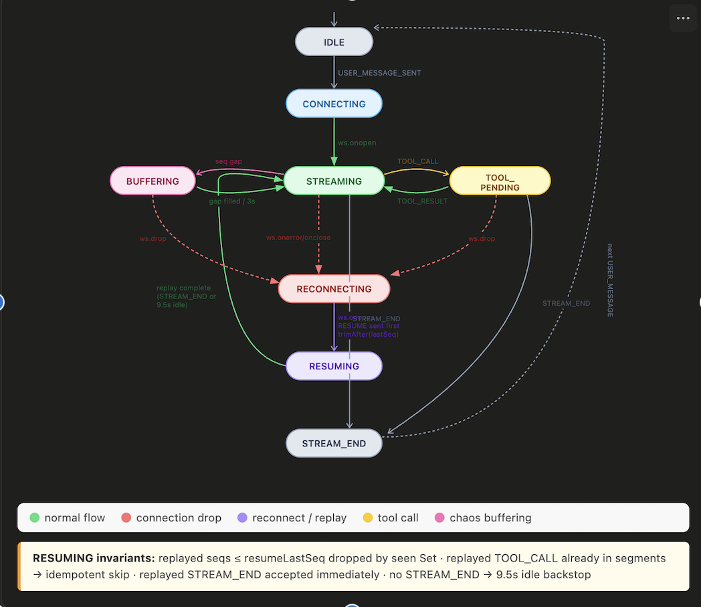
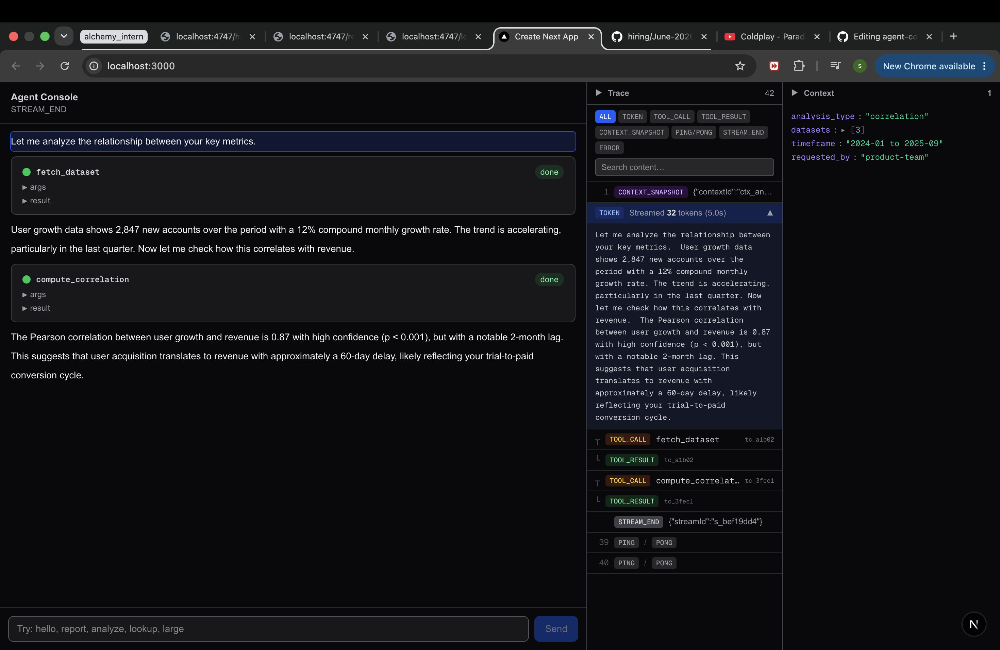
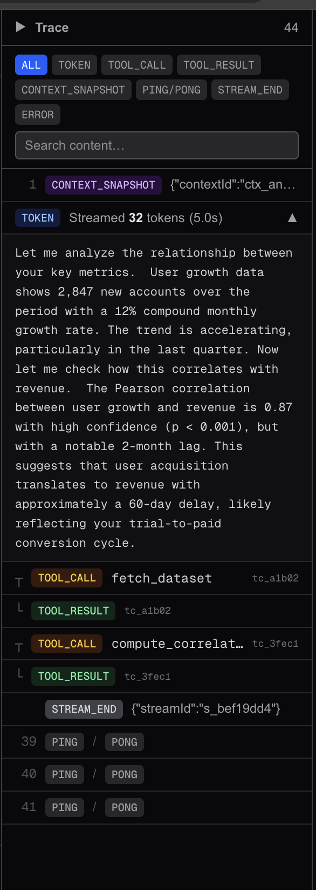
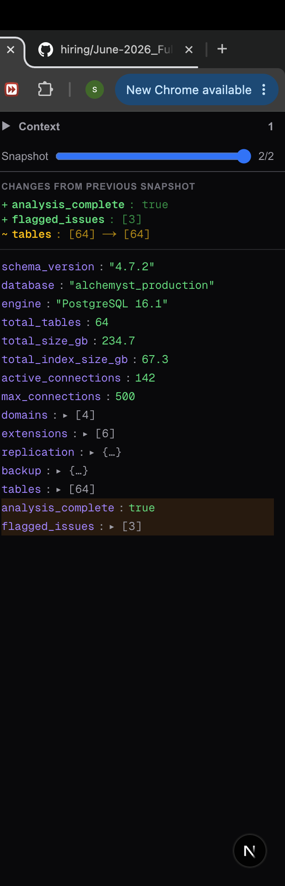

## Architecture

The app is built around a strict three-layer separation: a pure TypeScript AgentProtocol class, a useReducer hook runs a typed state machine that translates protocol events into render state, and React components are purely read-only renderers.

```
AgentProtocol (class, zero React imports)
  — seq ordering buffer, deduplication, PING/PONG, TOOL_ACK, reconnect + backoff, token batching
      ↓ clean ordered deduplicated actions
useAgentReducer (useReducer)
  — phase transitions, segment list, context snapshot history
      ↓ render state only
React components
  — read-only render, no protocol logic
```



---

## Running the App

### Prerequisites

- Node.js 18+
- Docker

### 1. Start the agent server

**Normal mode**

```bash
docker build -t agent-server ./agent-server
docker run -p 4747:4747 agent-server
```

**Chaos mode**

```bash
docker run -p 4747:4747 agent-server --mode chaos
```

Verify the server is up:

```bash
curl http://localhost:4747/health
```

### 2. Start the console

```bash
npm install
npm run build
npm run start
```

Open **http://localhost:3000**

No environment variables required. WebSocket URL defaults to `ws://localhost:4747/ws`.

---

## Screenshots in normal mode

### Full console — streaming chat, trace timeline, context panel



### Trace timeline — grouped tokens, tool call pairs, PING/PONG rows



### Context inspector — structural diff between two snapshots


