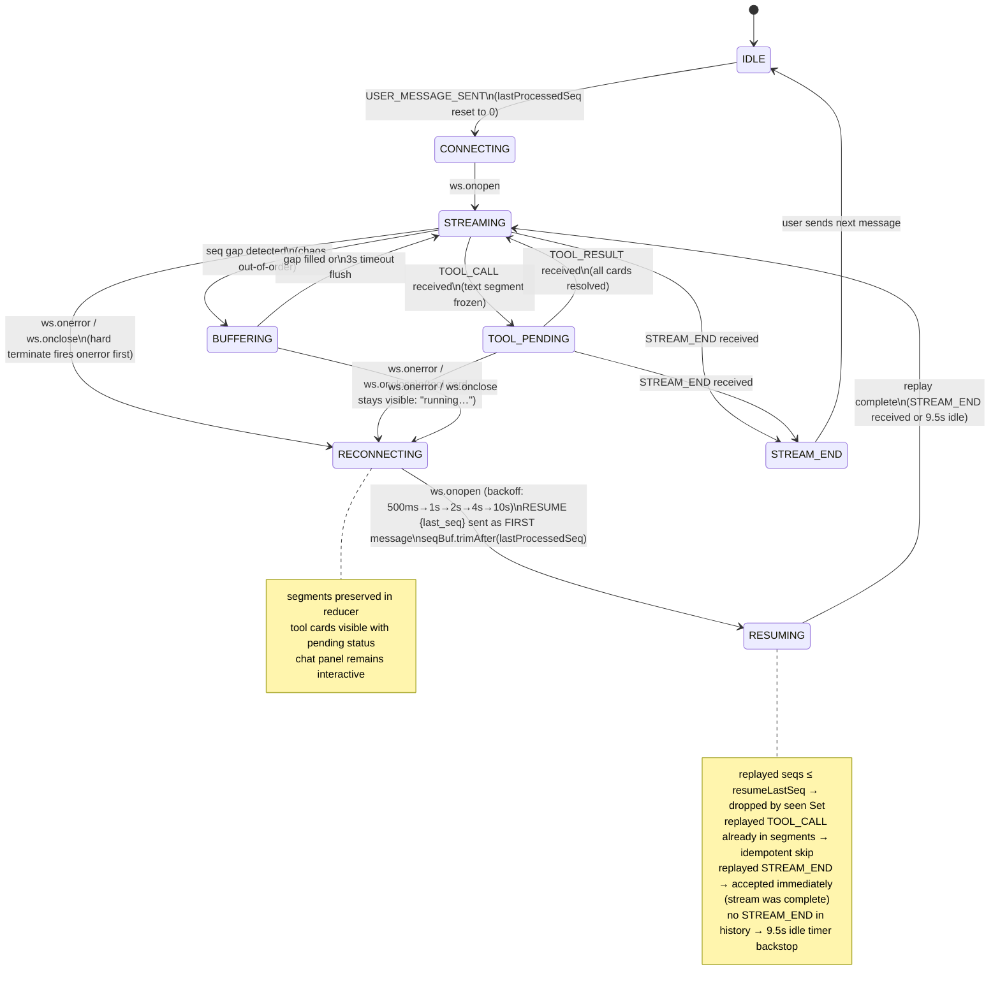

# Agent Console

A real-time AI agent console built in Next.js 14 (App Router) that connects to a mock AI agent backend over WebSocket, renders streaming token responses with mid-stream tool call interruptions, displays a live protocol trace timeline, and survives deliberate chaos — dropped connections, out-of-order messages, duplicate events, and corrupt heartbeats.

---

## Architecture

The system is a **distributed systems problem with a render loop attached**, not a chat UI exercise. Three layers are kept strictly separate — no cross-boundary imports:

```
AgentProtocol (class, zero React imports)
  — seq ordering buffer, deduplication, PING/PONG, TOOL_ACK, reconnect + backoff, token batching
      ↓ clean ordered deduplicated actions
useAgentReducer (useReducer)
  — phase transitions, segment list, context snapshot history
      ↓ render state only
React components
  — read-only render, no protocol logic
```

**Core insight:** True reconnection recovery requires tracking what the DOM has *consumed* (`lastProcessedSeq`, advanced only when the reducer commits a state update and React re-renders), not what the socket has *received* (`seqBuf.seen`). These diverge during rAF token-batch windows and React's async render scheduling. On reconnect, `RESUME { last_seq }` is sent with the DOM-committed value, and `seqBuf.trimAfter()` evicts any socket-ahead-of-DOM entries so the server's replay reaches the client cleanly.

---

## WebSocket State Machine



ASCII fallback for environments without Mermaid:

```
IDLE
 │ USER_MESSAGE_SENT (reset lastProcessedSeq=0)
 ▼
CONNECTING
 │ ws.onopen
 ▼
CONNECTED
 │ first TOKEN / CONTEXT_SNAPSHOT
 ▼
STREAMING ◄────────────────────────────────────────────────┐
 │                 │                                        │
 │ TOOL_CALL       │ seq gap                    TOOL_RESULT │
 ▼                 ▼                                        │
TOOL_PENDING    BUFFERING                                   │
 │   │            │ gap filled / 3s flush                   │
 │   └────────────┴───────────────────────────────────────► │
 │
 │ ws.onerror / ws.onclose  (from ANY active state)
 ▼
RECONNECTING  ← segments frozen, tool cards stay, chat interactive
 │ ws.onopen  (exponential backoff: 500 → 1000 → 2000 → 4000 → 10000ms)
 ▼
RESUMING
 │ RESUME {last_seq} sent FIRST (DOM-committed seq, not socket-received)
 │ seqBuf.trimAfter(resumeLastSeq) evicts socket-ahead-of-DOM entries
 │ replayed events stitched into existing segment list
 │ STREAM_END (replayed) → complete immediately
 │ no STREAM_END → 9.5s idle fires synthetic STREAM_END
 ▼
STREAMING  (existing segments preserved, replay content appended)
 │
 ▼
STREAM_END → IDLE
```

---

## Running the App

### Prerequisites

- Node.js 18+
- Docker

### 1. Start the agent server

**Normal mode** (no chaos — use this first, verify `/log` shows no violations):

```bash
docker build -t agent-server ./agent-server
docker run -p 4747:4747 agent-server
```

**Chaos mode** (connection drops, out-of-order messages, duplicate events, corrupt heartbeats):

```bash
docker run -p 4747:4747 agent-server --mode chaos
```

Verify the server is up:

```bash
curl http://localhost:4747/health
```

### 2. Start the console

```bash
npm install
npm run build
npm run start
```

Open **http://localhost:3000**

No environment variables required. WebSocket URL defaults to `ws://localhost:4747/ws`.

---

## Trigger Keywords

Send these messages in the console to exercise specific protocol paths:

| Message | Script | What it exercises |
|---|---|---|
| `hello` / `hi` | greeting | Tokens only, no tool calls — start here |
| `report` / `q3` | report_summary | 1 tool call mid-stream + 2 CONTEXT_SNAPSHOTs (diff case) |
| `analyze` / `compare` | multi_tool | 2 sequential tool calls, no CONTEXT updates between them |
| `lookup` / `find` / `search` | lookup | TOOL_CALL fires **before any tokens** — edge case |
| `large` / `schema` / `database` | large_context | ~550KB CONTEXT_SNAPSHOT + tool call + second snapshot |
| `long` / `document` / `detailed` | long_response | ~60 tokens + 1 tool call |
| _(anything else)_ | default | 1 tool call mid-stream |

---

## Verification

### Normal mode — must show zero violations

```bash
# After sending several messages:
curl http://localhost:4747/log | grep -i violation
# Expected: (empty)
```

### Reset server state between test runs

```bash
curl http://localhost:4747/reset
```

### Chaos mode checklist

Run these in chaos mode and verify the console recovers correctly:

```bash
# 1. Basic streaming — verify tokens render and no freeze
#    Send: hello

# 2. Tool call mid-stream — verify card shows "running…" during reconnect
#    Send: analyze   (2 sequential tool calls)

# 3. Tool before tokens — verify ToolCard renders before any text
#    Send: lookup

# 4. 550KB context snapshot — verify tab doesn't freeze, diff highlights
#    Send: large

# 5. Mid-stream drop + replay — verify text isn't duplicated after reconnect
#    Send: long
#    Toggle DevTools → Network → Offline during streaming, then back Online

# After each scenario:
curl http://localhost:4747/log | grep -i violation
```

---

## Project Structure

```
src/
  app/
    page.tsx                    # root layout, mounts useWebSocket
  components/
    StreamingChat/
      index.tsx                 # renders segments array
      TextChunk.tsx             # memo'd text segment
      ToolCard.tsx              # memo'd tool card (pending → resolved)
    TraceTimeline/
      index.tsx                 # live protocol event log
      TimelineRow.tsx           # individual event row
      FilterBar.tsx             # type + content filter
    ContextInspector/
      index.tsx                 # snapshot history + diff
      JsonTree.tsx              # lazily expanded JSON tree
      DiffView.tsx              # added / changed / removed highlights
      HistoryScrubber.tsx       # step through snapshot history
    ConnectionStatus.tsx        # reconnect banner with backoff countdown
  lib/
    AgentProtocol.ts            # WebSocket class — zero React imports
    seqBuffer.ts                # ordering + dedup — pure functions
    jsonDiff.ts                 # structural JSON diff — pure functions
    escape-hatch.ts             # only place `any` is permitted
  hooks/
    useAgentReducer.ts          # useReducer + all action/state types
    useWebSocket.ts             # mounts AgentProtocol, dispatches to reducer
  types/
    protocol.ts                 # copied from agent-server/src/types.ts
    state.ts                    # Segment, StreamState, ConnectionPhase
```

---

## Key Design Decisions

See [`DECISIONS.md`](./DECISIONS.md) for the full record. Highlights:

- **TOOL_CALL bypasses seq ordering** — holds in the buffer risks TOOL_ACK_TIMEOUT (2s window vs 8s chaos spike)
- **`lastProcessedSeq` written during React render, not useEffect** — prevents stale RESUME seq when ws.onclose fires before post-commit effects
- **`seqBuf.trimAfter(resumeLastSeq)`** — evicts socket-ahead-of-DOM entries so the server's replay isn't silently dropped by the dedup Set
- **Replayed STREAM_END accepted immediately** — if the stream completed before the drop, we dispatch STREAM_END at once rather than waiting 9.5s for the idle timer
- **PONG dedup per connection** — replayed PINGs from history don't trigger "unexpected PONG" violations on the new connection
- **TOOL_CALL idempotency in reducer** — prevents duplicate ToolSegment if React's async render scheduling leaves the same callId dispatched twice across a reconnect

---

## Known Protocol Race Condition

If the connection drops after `TOOL_CALL` arrives but before `TOOL_ACK` reaches the server, and replay suppresses the ACK (correct — the call was processed, just the ACK was lost in transit), the server logs a `TOOL_ACK_TIMEOUT` violation even though the client behaved correctly. The server cannot distinguish "ACK sent but lost" from "ACK never sent." This is a protocol design gap, not a client bug. See `DECISIONS.md §Known Protocol Race Condition` for full analysis.
